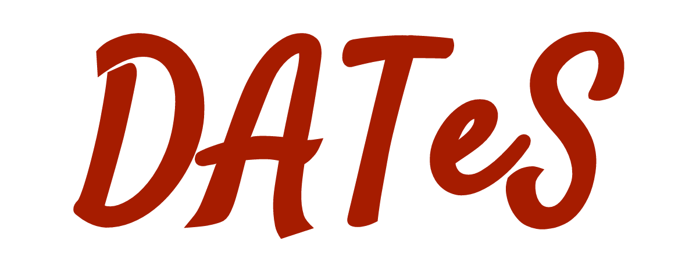

DATeS: Python-based Extensible **D**\ ata **A**\ ssimilation **T**\ esting **S**\ uite
======================================================================================

   

*DATeS is aimed to be a unified testing suite for data assimilation (DA) applications where researchers can collaborate, so that it would be much easier to understand and compare different methodologies in different settings. The core of DATeS is implemented in Python to enable for Object-Oriented capabilities. The main functionalities, such as the models, the data assimilation algorithms, the linear algebra solvers, and the time discretization routines are independent of each other, such as to offer maximum flexibility to configure data assimilation applications. DATeS can interface easily with large third party models written in Fortran or C, and with various external solvers.*

License
-------
                       
This program is subject to the terms of the Virginia Tech Non-Commercial/Commercial License. Using the software constitutes an implicit agreement with the terms of the license. You should receive a copy of the Virginia Tech Non-Commercial License with this program; if not, please contact the computational Science Laboratory to obtain it.                             

Contributors
------------
    
    +----+------------------------------+---------------------+
    | 1- |   Ahmed Attia                | attia@vt.edu        |
    +----+------------------------------+---------------------+
    | 2- |   Adrian Sandu               | sandu@cs.vt.edu     |
    +----+------------------------------+---------------------+
    | 3- |   Mahesh Narayanamurthi      | maheshnm@vt.edu     |
    +----+------------------------------+---------------------+
    | 4- |   Steven Ross Glandon        | rossg42@vt.edu      |
    +----+------------------------------+---------------------+
    | 5- |   Paul Tranquilli            | ptranq@vt.edu       |
    +----+------------------------------+---------------------+
    | 6- |   Arash Sarshar              | sarshar@vt.edu      |
    +----+------------------------------+---------------------+
    

