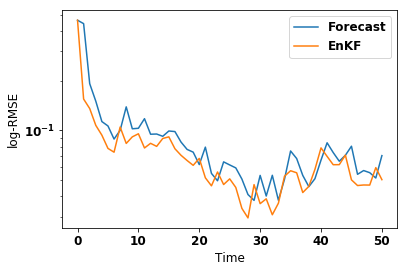
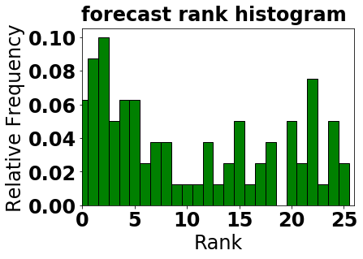
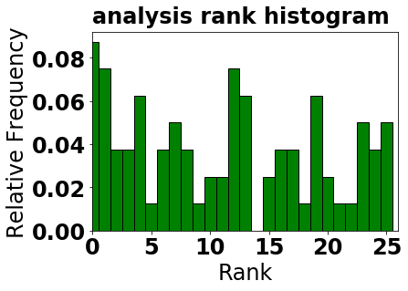

************************************************************
Example: Stochastic EnKF applied to Lorenz 96 (40 variables)
************************************************************

Download Source Code
====================

+ Download Python Script: :download:`lorenz96_enkf.py <lorenz96_enkf.py>`      
+ Download Jupyter Notebook: :download:`lorenz96_enkf.ipynb <lorenz96_enkf.ipynb>`

Notebook Run
============

.. code:: ipython2

    # 
    # DATeS: Data Assimilation Testing Suite.
    # Jupyter Tutorials.
    #
    
    # An example of a test driver:
    # ==============================
    # The driver file should be located in the root directory of DATeS.
    # So; if it is not there, make a copy in the DATES_ROOT_PATH!
    #
    #     1- Create an object of the Lorenz96 model;
    #     2- Create an of the DEnKF;
    #     3- Run DEnKF using Lorenz96 over a defined observation, and assimilation timespan.
    # 
    #     To Run the driver:
    #        On the linux terminal execute the following command:
    #            $ python lorenze96_enkf_test_driver.py
    #

.. code:: ipython2

    import sys
    import numpy as np
    import os

.. code:: ipython2

    # Define environment variables and update Python search path;
    # this is a necessary call that must be inserted in the beginning of any driver.
    
    import dates_setup
    dates_setup.initialize_dates(random_seed=0)
    
    import dates_utility as utility  # import DATeS utility module(s)

.. code:: ipython2

    # Create a model object
    
    from lorenz_models import Lorenz96  as Lorenz
    model = Lorenz(model_configs={'create_background_errors_correlations':True})

.. code:: ipython2

    # create observations' and assimilation checkpoints:
    
    obs_checkpoints = np.arange(0, 5.001, 0.1)
    da_checkpoints = obs_checkpoints

.. code:: ipython2

    # Create DA pieces; this includes:
    # ---------------------------------
    #   i-   forecast trajectory/state
    #   ii-  initial ensemble, 
    #   iii- filter/smoother/hybrid object.

.. code:: ipython2

    # create initial ensemble:
    
    ensemble_size = 25
    initial_ensemble = model.create_initial_ensemble(ensemble_size=ensemble_size)

.. code:: ipython2

    # import, configure, and create filter object:
    
    from EnKF import EnKF as StochasticEnKF
    enkf_filter_configs = dict(model=model,
                               analysis_ensemble=initial_ensemble,
                               forecast_ensemble=None,
                               ensemble_size=ensemble_size,
                               inflation_factor=1.05,
                               obs_covariance_scaling_factor=1.0,
                               obs_adaptive_prescreening_factor=None,
                               localize_covariances=True,
                               localization_method='covariance_filtering',
                               localization_radius=4,
                               localization_function='gauss',
                               )
    
    filter_obj = StochasticEnKF(filter_configs=enkf_filter_configs, 
                                output_configs=dict(file_output_moment_only=False)
                                )

.. code:: ipython2

    # Create sequential DA process:
    # -----------------------------
    
    # + processing object; here this is a filtering_process object:
    
    from filtering_process import FilteringProcess
    experiment = FilteringProcess(assimilation_configs=dict(model=model,
                                                            filter=filter_obj,
                                                            obs_checkpoints=obs_checkpoints,
                                                            da_checkpoints=da_checkpoints,
                                                            forecast_first=True,
                                                            ref_initial_condition=model._reference_initial_condition.copy(),
                                                            ref_initial_time=0,
                                                            random_seed=0
                                                            ),
                                  output_configs = dict(scr_output=True,
                                                        scr_output_iter=1,
                                                        file_output=True,
                                                        file_output_iter=1)
                                  )

.. parsed-literal::

    Caution: Unknown key detected: 'model'. Ignored and defaults are restored if necessary

.. code:: ipython2

    # run the sequential filtering over the timespan created by da_checkpoints
    
    experiment.recursive_assimilation_process()

.. parsed-literal::

    Filtering:EnKF: FORECAST[time:1.000e-01 > RMSE:4.41799e-01]  :: ANALYSIS[time:1.000e-01 > RMSE:1.54857e-01]
    Filtering:EnKF: FORECAST[time:2.000e-01 > RMSE:1.91746e-01]  :: ANALYSIS[time:2.000e-01 > RMSE:1.35688e-01]
    Filtering:EnKF: FORECAST[time:3.000e-01 > RMSE:1.50330e-01]  :: ANALYSIS[time:3.000e-01 > RMSE:1.07414e-01]
    Filtering:EnKF: FORECAST[time:4.000e-01 > RMSE:1.13204e-01]  :: ANALYSIS[time:4.000e-01 > RMSE:9.36892e-02]
    Filtering:EnKF: FORECAST[time:5.000e-01 > RMSE:1.06511e-01]  :: ANALYSIS[time:5.000e-01 > RMSE:7.79400e-02]
    Filtering:EnKF: FORECAST[time:6.000e-01 > RMSE:8.87518e-02]  :: ANALYSIS[time:6.000e-01 > RMSE:7.39435e-02]
    Filtering:EnKF: FORECAST[time:7.000e-01 > RMSE:1.00197e-01]  :: ANALYSIS[time:7.000e-01 > RMSE:1.04900e-01]
    Filtering:EnKF: FORECAST[time:8.000e-01 > RMSE:1.38874e-01]  :: ANALYSIS[time:8.000e-01 > RMSE:8.35335e-02]
    Filtering:EnKF: FORECAST[time:9.000e-01 > RMSE:1.02409e-01]  :: ANALYSIS[time:9.000e-01 > RMSE:9.15324e-02]
    Filtering:EnKF: FORECAST[time:1.000e+00 > RMSE:1.03131e-01]  :: ANALYSIS[time:1.000e+00 > RMSE:9.55284e-02]
    Filtering:EnKF: FORECAST[time:1.100e+00 > RMSE:1.17836e-01]  :: ANALYSIS[time:1.100e+00 > RMSE:7.84137e-02]
    Filtering:EnKF: FORECAST[time:1.200e+00 > RMSE:9.49343e-02]  :: ANALYSIS[time:1.200e+00 > RMSE:8.36639e-02]
    Filtering:EnKF: FORECAST[time:1.300e+00 > RMSE:9.52052e-02]  :: ANALYSIS[time:1.300e+00 > RMSE:8.01750e-02]
    Filtering:EnKF: FORECAST[time:1.400e+00 > RMSE:9.22390e-02]  :: ANALYSIS[time:1.400e+00 > RMSE:8.94760e-02]
    Filtering:EnKF: FORECAST[time:1.500e+00 > RMSE:9.92887e-02]  :: ANALYSIS[time:1.500e+00 > RMSE:9.15390e-02]
    Filtering:EnKF: FORECAST[time:1.600e+00 > RMSE:9.85242e-02]  :: ANALYSIS[time:1.600e+00 > RMSE:7.75898e-02]
    Filtering:EnKF: FORECAST[time:1.700e+00 > RMSE:8.51567e-02]  :: ANALYSIS[time:1.700e+00 > RMSE:7.08369e-02]
    Filtering:EnKF: FORECAST[time:1.800e+00 > RMSE:7.68633e-02]  :: ANALYSIS[time:1.800e+00 > RMSE:6.58739e-02]
    Filtering:EnKF: FORECAST[time:1.900e+00 > RMSE:7.39954e-02]  :: ANALYSIS[time:1.900e+00 > RMSE:6.16061e-02]
    Filtering:EnKF: FORECAST[time:2.000e+00 > RMSE:6.22567e-02]  :: ANALYSIS[time:2.000e+00 > RMSE:6.78411e-02]
    Filtering:EnKF: FORECAST[time:2.100e+00 > RMSE:7.93470e-02]  :: ANALYSIS[time:2.100e+00 > RMSE:5.17941e-02]
    Filtering:EnKF: FORECAST[time:2.200e+00 > RMSE:5.50531e-02]  :: ANALYSIS[time:2.200e+00 > RMSE:4.63245e-02]
    Filtering:EnKF: FORECAST[time:2.300e+00 > RMSE:4.96878e-02]  :: ANALYSIS[time:2.300e+00 > RMSE:5.61490e-02]
    Filtering:EnKF: FORECAST[time:2.400e+00 > RMSE:6.46347e-02]  :: ANALYSIS[time:2.400e+00 > RMSE:4.71756e-02]
    Filtering:EnKF: FORECAST[time:2.500e+00 > RMSE:6.19376e-02]  :: ANALYSIS[time:2.500e+00 > RMSE:5.10353e-02]
    Filtering:EnKF: FORECAST[time:2.600e+00 > RMSE:5.94379e-02]  :: ANALYSIS[time:2.600e+00 > RMSE:4.52964e-02]
    Filtering:EnKF: FORECAST[time:2.700e+00 > RMSE:5.09120e-02]  :: ANALYSIS[time:2.700e+00 > RMSE:3.38622e-02]
    Filtering:EnKF: FORECAST[time:2.800e+00 > RMSE:4.10449e-02]  :: ANALYSIS[time:2.800e+00 > RMSE:2.96530e-02]
    Filtering:EnKF: FORECAST[time:2.900e+00 > RMSE:3.78331e-02]  :: ANALYSIS[time:2.900e+00 > RMSE:4.71067e-02]
    Filtering:EnKF: FORECAST[time:3.000e+00 > RMSE:5.35519e-02]  :: ANALYSIS[time:3.000e+00 > RMSE:3.61586e-02]
    Filtering:EnKF: FORECAST[time:3.100e+00 > RMSE:4.02017e-02]  :: ANALYSIS[time:3.100e+00 > RMSE:3.86665e-02]
    Filtering:EnKF: FORECAST[time:3.200e+00 > RMSE:5.36403e-02]  :: ANALYSIS[time:3.200e+00 > RMSE:3.09878e-02]
    Filtering:EnKF: FORECAST[time:3.300e+00 > RMSE:3.79090e-02]  :: ANALYSIS[time:3.300e+00 > RMSE:3.63918e-02]
    Filtering:EnKF: FORECAST[time:3.400e+00 > RMSE:5.07619e-02]  :: ANALYSIS[time:3.400e+00 > RMSE:5.29276e-02]
    Filtering:EnKF: FORECAST[time:3.500e+00 > RMSE:7.52050e-02]  :: ANALYSIS[time:3.500e+00 > RMSE:5.71445e-02]
    Filtering:EnKF: FORECAST[time:3.600e+00 > RMSE:6.77043e-02]  :: ANALYSIS[time:3.600e+00 > RMSE:5.55418e-02]
    Filtering:EnKF: FORECAST[time:3.700e+00 > RMSE:5.35620e-02]  :: ANALYSIS[time:3.700e+00 > RMSE:4.21946e-02]
    Filtering:EnKF: FORECAST[time:3.800e+00 > RMSE:4.58062e-02]  :: ANALYSIS[time:3.800e+00 > RMSE:4.59728e-02]
    Filtering:EnKF: FORECAST[time:3.900e+00 > RMSE:5.11464e-02]  :: ANALYSIS[time:3.900e+00 > RMSE:5.82294e-02]
    Filtering:EnKF: FORECAST[time:4.000e+00 > RMSE:6.62760e-02]  :: ANALYSIS[time:4.000e+00 > RMSE:7.84972e-02]
    Filtering:EnKF: FORECAST[time:4.100e+00 > RMSE:8.42724e-02]  :: ANALYSIS[time:4.100e+00 > RMSE:6.97444e-02]
    Filtering:EnKF: FORECAST[time:4.200e+00 > RMSE:7.36000e-02]  :: ANALYSIS[time:4.200e+00 > RMSE:6.21330e-02]
    Filtering:EnKF: FORECAST[time:4.300e+00 > RMSE:6.52134e-02]  :: ANALYSIS[time:4.300e+00 > RMSE:6.21899e-02]
    Filtering:EnKF: FORECAST[time:4.400e+00 > RMSE:7.08265e-02]  :: ANALYSIS[time:4.400e+00 > RMSE:7.10172e-02]
    Filtering:EnKF: FORECAST[time:4.500e+00 > RMSE:8.03555e-02]  :: ANALYSIS[time:4.500e+00 > RMSE:5.03395e-02]
    Filtering:EnKF: FORECAST[time:4.600e+00 > RMSE:5.43731e-02]  :: ANALYSIS[time:4.600e+00 > RMSE:4.65153e-02]
    Filtering:EnKF: FORECAST[time:4.700e+00 > RMSE:5.72898e-02]  :: ANALYSIS[time:4.700e+00 > RMSE:4.68711e-02]
    Filtering:EnKF: FORECAST[time:4.800e+00 > RMSE:5.56201e-02]  :: ANALYSIS[time:4.800e+00 > RMSE:4.68172e-02]
    Filtering:EnKF: FORECAST[time:4.900e+00 > RMSE:5.16520e-02]  :: ANALYSIS[time:4.900e+00 > RMSE:5.96749e-02]
    Filtering:EnKF: FORECAST[time:5.000e+00 > RMSE:7.05062e-02]  :: ANALYSIS[time:5.000e+00 > RMSE:5.04725e-02]

.. code:: ipython2

    # retrieve/read  results:
    out_dir_tree_structure_file = 'Results/Filtering_Results/output_dir_structure.txt'
    filtering_results = read_filter_output(out_dir_tree_structure_file)
    
    reference_states = filtering_results[2]
    forecast_ensembles = filtering_results[3]
    analysis_ensembles = filtering_results[5]
    forecast_times = filtering_results[8]
    analysis_times = filtering_results[9]
    forecast_rmse = filtering_results[11]
    analysis_rmse = filtering_results[12]
    filter_configs = filtering_results[13]

.. code:: ipython2

    # 1- plot RMSE:
    
    import matplotlib.pyplot as plt
    
    fig_rmse = plt.figure(facecolor='white')
    plt.semilogy(forecast_times, forecast_rmse, label='Forecast')
    plt.semilogy(analysis_times, analysis_rmse, label=filter_configs['filter_name'])
    
    plt.xlabel('Time')
    plt.ylabel('log-RMSE')
    xlables = [forecast_times[i] for i in xrange(0, len(forecast_times), 10)]
    plt.xticks(xlables, 10*np.arange(len(xlables)))
    
    plt.legend(loc='upper right')
    plt.show()

.. code:: ipython2

    # 2- plot rank histogrmas:
    
    _ = utility.rank_hist(forecast_ensembles, 
                          reference_states,
                          draw_hist=True, 
                          hist_type='relfreq',
                          hist_title='forecast rank histogram'
                         )
    _ = utility.rank_hist(analysis_ensembles,
                          reference_states,
                          draw_hist=True,  
                          hist_type='relfreq', 
                          hist_title='analysis rank histogram'
                          )
    plt.show()

.. code:: ipython2

    # Clean executables and temporary modules:
    
    utility.clean_executable_files()

